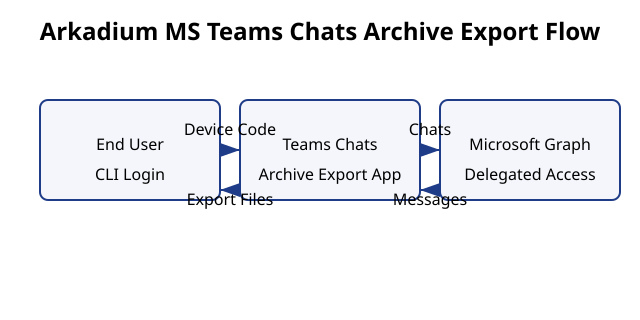

# Teams Export

Command-line utility for exporting Microsoft Teams 1:1 and group chat messages using the Microsoft Graph API.



Additional background lives in the internal wiki: [Arkadium IT Knowledge Base](https://arkadium.atlassian.net/wiki/spaces/IT/overview).

## Setup

1. Ensure Python 3.10 or later is available.
   - Fastest path: [`uv`](https://docs.astral.sh/uv/) – `uv python install 3.11 && uv venv --python 3.11 && uv pip install -e .`
   - Alternative: provision Python ≥3.10 and use `python -m venv .venv && source .venv/bin/activate && pip install -e .`
2. Install the project in editable mode:

   ```bash
   pip install -e .
   ```

3. Create (or import) the Azure AD application **Arkadium MS Teams Chats Archive Export** with delegated permissions `Chat.Read` and `Chat.ReadBasic`. You can import `azure/app-manifest.json` during registration to pre-populate the correct scope list, internal note, and wiki/home page URLs so tenant admins see the documentation context.
   - After creation, grant admin consent once so end users do not see repeated prompts.
   - Record the generated `Application (client) ID` and, if applicable, your tenant ID.
4. Copy `config.sample.json` to `~/.teams-exporter/config.json` and update the placeholders:

   ```json
   {
     "client_id": "YOUR_CLIENT_ID",
     "authority": "https://login.microsoftonline.com/YOUR_TENANT_ID",
    "scopes": ["Chat.Read", "Chat.ReadBasic"],
     "token_cache_path": "~/.teams-exporter/token_cache.json"
   }
   ```

   You can also provide `TEAMS_EXPORT_CLIENT_ID` and related environment variables instead of a config file.

## Usage

```
teams-export --user "john.smith@company.com" --from 2025-10-23 --to 2025-10-23 --format json
```

<<<<<<< Updated upstream
- `--user` targets 1:1 chats by participant name or email.
- `--chat` targets group chats by display name.
- `--from` / `--to` accept `YYYY-MM-DD`, `today`, or `last week`.
- `--format` supports `json` (default) or `csv`.
=======
This will:
1. Authenticate with Microsoft Graph
2. Show an interactive menu with your 20 most recent chats
3. Let you select the chat by number
4. Export today's messages in Jira-friendly format

### Export by User Email (1:1 chats)

```bash
teams-export --user "john.smith@company.com"
```

### Export by Chat Name (Group chats)

```bash
teams-export --chat "Project Alpha Team"
```

### Export with Date Range

```bash
# Specific dates
teams-export --user "john.smith@company.com" --from 2025-10-23 --to 2025-10-25

# Using keywords
teams-export --user "john.smith@company.com" --from "last week" --to "today"
```

### Export in Different Formats

```bash
# Markdown (default) - works in Jira, GitHub, Confluence, etc.
teams-export --user "john.smith@company.com" --format jira

# JSON for programmatic processing
teams-export --user "john.smith@company.com" --format json

# CSV for spreadsheet analysis
teams-export --user "john.smith@company.com" --format csv

# HTML with embedded images (for copy-pasting to Jira/Confluence)
teams-export --user "john.smith@company.com" --format html

# Word document with embedded images (best for Jira/Confluence)
teams-export --user "john.smith@company.com" --format docx
```

The default Markdown format includes:
- Standard Markdown syntax (compatible with Jira, GitHub, Confluence)
- Clickable links for attachments
- Inline image rendering for shared images
- Message quotes and formatting preserved

### Other Options

>>>>>>> Stashed changes
- `--list` prints available chats with participants.
- `--all` exports every chat in the provided window.
- `--force-login` clears the cache and forces a new device code login.
<<<<<<< Updated upstream
=======
- `--refresh-cache` forces refresh of chat list (bypasses 24-hour cache).
- `--output-dir` specifies where to save exports (default: `./exports/`).
- `--download-attachments/--no-download-attachments` enable/disable attachment downloads (default: enabled).
- `--download-all-attachments` download ALL attachment types (PDFs, docs, etc.), not just images.
- `--incremental` use incremental sync to only fetch new messages since last export.
- `--parallel-fetch/--sequential-fetch` toggles an **experimental** multi-threaded paginator (default remains sequential; parallel mode is temporarily unstable and should only be used while testing fixes).
>>>>>>> Stashed changes

Exports are saved under `./exports/` by default with filenames like `john_smith_2025-10-23.json`.

## Token Cache

<<<<<<< Updated upstream
MSAL token cache is stored at `~/.teams-exporter/token_cache.json`. The cache refreshes automatically; re-run with `--force-login` to regenerate the device flow.

## Limitations

- Requires delegated permissions for the signed-in user.
- Attachments are referenced in the output but not downloaded.
- Microsoft Graph API throttling is not yet handled with automatic retries.
=======
```bash
# Interactive selection with custom date range
teams-export --from "2025-10-01" --to "2025-10-31"

# Export all chats from last week in parallel
teams-export --all --from "last week" --format jira

# List all available chats
teams-export --list

# Export specific user's chat for today
teams-export --user "jane.doe@company.com"

# Incremental export - only fetch new messages since last sync
teams-export --user "jane.doe@company.com" --incremental

# Export with all attachments (PDFs, docs, etc.)
teams-export --user "john.smith@company.com" --download-all-attachments

# Incremental export for all chats with full attachment downloads
teams-export --all --incremental --download-all-attachments
```

Exports are saved under `./exports/` by default with filenames like `john_smith_2025-10-23.md` (for Markdown/Jira format) or `john_smith_2025-10-23.json`.

## Caching

### Token Cache
MSAL token cache is stored at `~/.teams-exporter/token_cache.json`. The cache refreshes automatically; re-run with `--force-login` to regenerate the device flow.

### Chat List Cache
To speed up repeated operations, the chat list is cached locally for 24 hours at `~/.teams-exporter/cache/chats_cache.json`.

**First run:** Loads all chats from API (~30-60 seconds for 1000+ chats)
**Subsequent runs (within 24h):** Instant load from cache

To refresh the cache:
- **Interactive menu**: Press `c` during chat selection to refresh and reload
- **Command line**: Use `--refresh-cache` flag to force refresh before showing menu

**Note:** Chats are sorted by last message timestamp (using `lastMessagePreview`), matching the behavior of the Teams desktop client.

### Graph API Sorting Limitation

The Microsoft Graph API's `/me/chats` endpoint does **not** support the `$orderby` query parameter ([see official documentation](https://learn.microsoft.com/en-us/graph/api/chat-list?view=graph-rest-1.0&tabs=http#optional-query-parameters)). This means:

- Chats cannot be sorted server-side by last message time
- All chats must be loaded to achieve correct chronological sorting
- Client-side sorting is performed using `lastMessagePreview.createdDateTime`

This is why the initial load fetches all chats (with progress indication) rather than loading only the most recent N chats. The 24-hour cache ensures subsequent runs are instant.

## Features

### Performance Optimizations
- **Chat list caching**: 24-hour local cache makes repeated runs instant
- **Parallel exports**: When using `--all`, exports multiple chats concurrently (up to 3 at once)
- **Automatic retry**: Handles API rate limiting (429) and server errors (5xx) with exponential backoff
- **Optimized pagination**: Fetches 50 messages per request (Graph API maximum)
- **Smart filtering**: Stops fetching when messages are outside the date range
- **Parallel message fetching**: New parallel pagination for faster message loading on large chats
- **Parallel attachment downloads**: Download multiple attachments concurrently (up to 5 workers)
- **Experimental parallel pagination (needs fix)**: `--parallel-fetch` exposes the unfinished concurrent paginator. It is disabled by default because it can hang; only enable when working on the High Priority “Faster Message Pagination” TODO item.

### Incremental Sync (New!)
- **Delta sync support**: Use `--incremental` flag to fetch only new messages since last export
- **State persistence**: Tracks last sync per chat in `~/.teams-exporter/delta/`
- **Automatic change detection**: Skips export if no new messages found
- **Bandwidth optimization**: Reduces API calls and download time for regular exports

### User Experience Improvements
- **Interactive chat selection**: Beautiful menu with chat names, types, and last activity
- **Multiple match handling**: If search finds multiple chats, shows menu instead of error
- **Markdown format**: Standard Markdown output that works in Jira, GitHub, Confluence, and other platforms
  - Clean HTML conversion (removes tags, preserves formatting)
  - Blockquote formatting (`>`) for message content
  - Standard Markdown headers (`##`, `###`) and emphasis (`**bold**`, `*italic*`)
  - Attachment support with clickable links
  - **Image support**: Images from chat attachments rendered as ``
  - **Full attachment support**: Download PDFs, documents, spreadsheets, and more with `--download-all-attachments`
  - Reaction indicators
  - Proper timestamp formatting
- **Smart defaults**: Defaults to today's date if not specified
- **Progress tracking**: Shows real-time progress for multi-chat exports

## Limitations

- Requires delegated permissions for the signed-in user.
- ~~Attachments are referenced in the output but not downloaded.~~ **Fixed!** Attachments can now be downloaded with `--download-attachments` (images only) or `--download-all-attachments` (all types).
- Parallel exports limited to 3 concurrent requests to avoid API throttling.
>>>>>>> Stashed changes

## Security Notes

- The CLI never stores usernames or passwords; authentication uses Azure AD device code flow with delegated scopes.
- Refresh and access tokens are cached locally in the path you configure (`token_cache.json`). Rotate/clear the cache by deleting that file or running with `--force-login`.
- No application secrets or certificates are created for this public client; there are no service-principal credentials to rotate unless you deliberately add them later.

## Azure AD App Automation

Prefer commands over the Azure Portal? The scripts below use the templates under `azure/` to reproduce the same configuration.

```bash
# 1. Create the public client app with delegated chat scopes
az ad app create \
  --display-name "Arkadium MS Teams Chats Archive Export" \
  --sign-in-audience AzureADMyOrg \
  --is-fallback-public-client \
  --public-client-redirect-uris https://login.microsoftonline.com/common/oauth2/nativeclient \
  --required-resource-accesses @azure/required-resource-accesses.json

# Capture the returned identifiers
#   appId  -> client ID used in config.sample.json
#   id     -> application object ID for subsequent PATCH/PUT calls

# 2. Apply internal note + documentation links
az rest \
  --method PATCH \
  --uri "https://graph.microsoft.com/v1.0/applications/<application-object-id>" \
  --headers Content-Type=application/json \
  --body '{
    "notes": "This application can be used to retrieve your history of the conversations from MS Teams using Graph API and Python.",
    "info": { "marketingUrl": "https://arkadium.atlassian.net/wiki/spaces/IT/overview" },
    "web": { "homePageUrl": "https://arkadium.atlassian.net/wiki/spaces/IT/overview" }
  }'

# 3. Upload the consent screen logo (PNG or JPG)
az rest \
  --method PUT \
  --uri "https://graph.microsoft.com/v1.0/applications/<application-object-id>/logo" \
  --headers "Content-Type=image/png" \
  --body @/path/to/logo.png

# Optional: mirror the logo to the enterprise application
az rest \
  --method PUT \
  --uri "https://graph.microsoft.com/v1.0/servicePrincipals/<service-principal-object-id>/logo" \
  --headers "Content-Type=image/png" \
  --body @/path/to/logo.png

# 4. Grant tenant-wide consent once the Graph permissions look correct
az ad app permission admin-consent --id <appId>
```

- Replace the placeholder IDs with the values returned from the create command (`appId` for client ID and `id` for subsequent REST operations; service principal ID appears in `az ad sp list --filter "appId eq '<appId>'"`).
- The same `required-resource-accesses.json` is what the manifest references; use one or the other to keep scope definitions in sync.
